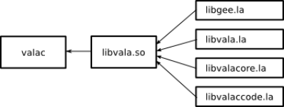
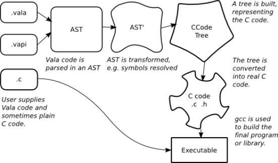

# 3.1. Vala in a Nutshell

The Vala compiler **valac** is a small shell around libvala which
handles command-line arguments, locates the sources and libraries which
are required, and drives the compilation procedure.

**How valac is linked**

All the important work such as parsing, error checking/reporting, code
generation, calling **gcc**, is done in libvala.

The code for **valac** can be found in `compiler/valacompiler.vala`.

## 3.1.1. Command-line Options

These are handled in the normal way by the Vala binding to
*GLib.OptionContext*. Most of the instance variables in Vala.Compiler
are referenced in the options array. It's not very interesting.

## 3.1.2. The Compilation Procedure and Vala.CodeContext

Vala.Compiler plugs together the classes of libvala in a big pipeline.
This modular design makes Vala more maintainable and external tools can
easily use this code.

## 3.1.3. The valac Pipeline

1.  Initialize CodeContext with command-line options.
2.  Add packages from command-line and others depending on the profile.
3.  Add sources, Vala, Genie, Gir, VAPI, and C from command-line.
4.  Parse everything.
5.  Resolve symbols.
6.  Run the Semantic Analyzer.
7.  Run the Flow Analyzer.
8.  Use the code generator to emit code.
9.  Write out VAPI and GIDL files, if a library is being compiled.
10. Compile the generated C code.

The individual steps will be explained later, but first
`Vala.CodeContext`, the data structure which holds everything together.
It stores the compile options which were specified on the command line,
and a list of source files to compile. There is only one `CodeContext`
instantiated and its reference is passed around a lot, so effectively
it's a global variable.

Vala.CodeContext is the root of the code tree, because it contains the
root Namespace, which holds references to all parsed code nodes. In
addition to the code tree, the context contains a reference to a code
generator object. This object walks the code tree and generates code.

Vala.CodeContext contains an important method called `accept`, which
initiates a depth-first traversal of the code tree. This method, and the
CodeVisitor pattern, will be discussed later.

**Data diagram**

The Vala code tree is an abstract syntax tree (AST) built by parsing the
Vala sources. For example, if you see a class called `Vala.Destructor`
which inherits `Vala.Symbol`, then it is a part of the AST. Data
structures for the AST and the parser which builds it are in the `vala`
directory.

Vala also uses a tree to represent the C `ccode` that will be output.
Data structures for the C code (CCode classes) tree are in the `ccode`
directory.

The machinery which transforms the Vala AST into a C code tree is in the
`codegen` directory arranged in a modular visitor. The AST is traversed
and a CCode tree is created.

Vala is split upon these lines, most probably to break the system into
conceptually-related, understandable chunks. However, with suitable
modifications, the different modules could be replaced. Conceivably,
Vala could produce non-GObject C code. More realistically, Vala could
produce intermediate code as a [GCC frontend](http://gcc.gnu.org/frontends.html).
