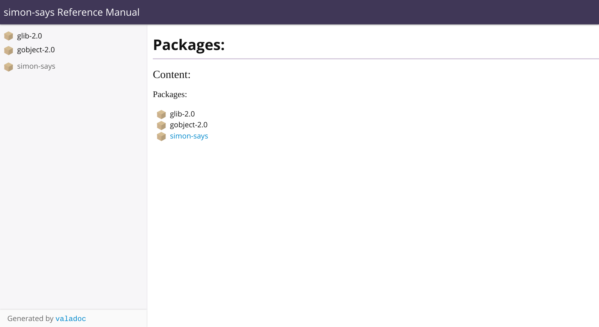
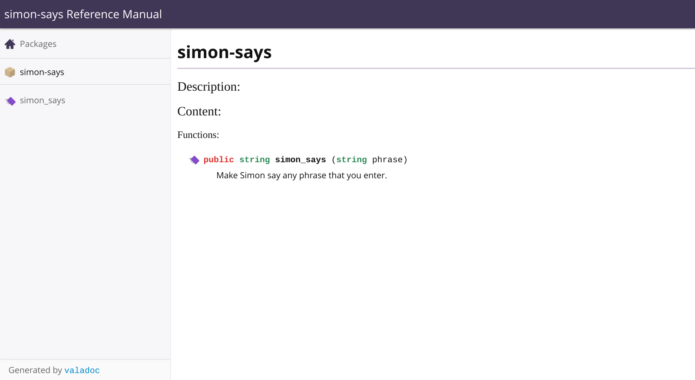
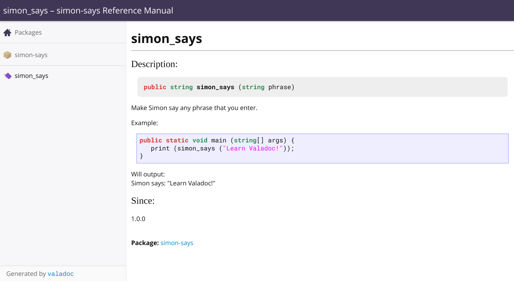

# 1. Quick Start

## 1.1. Basic Usage

::: warning Warning

The `valadoc` command line tool may not be bundled with your
installation of the Vala. To follow this example, install the `valadoc`
tool in your operating system.
:::

First find an empty directory/create a new directory.

Then, in that directory, create a file called `lib.vala` with the
following contents:

```vala
/**
 * Make Simon say any phrase that you enter.
 *
 * Example:
 * {{{
 * public static void main (string[] args) {
 *    print (simon_says ("Learn Valadoc!"));
 * }
 * }}}
 *
 * Will output:<<BR>>
 * Simon says: "Learn Valadoc!"
 *
 * @since 1.0.0
 */
 public string simon_says (string phrase) {
     return @"Simon says: \"$(phrase)\"";
 }
```

Generate the documentation for the code by running the following command:

```shell
valadoc --package-name="simon-says" --package-version=1.0.0 -o docs lib.vala
```

::: warning Warning

If you run this command more than once, you'll see the following error:

```shell
error: File already exists
```

To avoid this issue, add the `--force` flag to the command

```shell
valadoc --force --package-name="simon-says" --package-version=1.0.0 -o docs lib.vala
```

However, be aware that `--force` does not remove any documentation. It
only adds and overwrites documentation.
:::

This will generate the documentation of the code in the `docs`
directory.

Open `docs/index.html` in a web browser to view the generated
documentation:



Select the "simon-says" package to view its contents:



Now, you can see the `simon_says` function that you wrote in `lib.vala`.
Select it to view the full documentation of the function:


