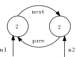
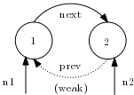
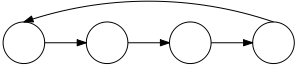
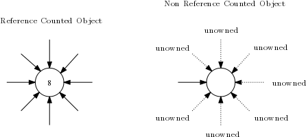
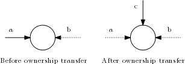

# Memory management

Original source: [Projects/Vala/ReferenceHandling](https://wiki.gnome.org/Projects/Vala/ReferenceHandling) on the archived GNOME Wiki.

For ownership rules when writing VAPI bindings, see also [Using Vala's Automatic Memory Management](bindings/writing-a-vapi-manually/03-00-using-auto-memory-management).

## Vala's memory management explained

Vala's memory management is based on **automatic reference counting** instead of tracing garbage collection.

That has both [advantages and disadvantages](https://en.wikipedia.org/wiki/Reference_counting#Advantages_and_disadvantages). Reference counting is deterministic, but you can form **reference cycles** in some cases. In those cases you must use [weak references](https://en.wikipedia.org/wiki/Weak_reference) to break the cycles. The Vala keyword for this is `weak`.

### How reference counting works

Each time a reference-type object is assigned to a variable (referenced), its internal reference count is increased by one (`ref`). Each time a reference variable goes out of scope, the object's reference count is decreased by one (`unref`).

If an object's reference count reaches zero, the object is freed. When an object is freed, each of its reference-type fields has its reference count decreased (`unref`). If one of those reaches zero, it is freed the same way, and so on.

### Reference cycles

A **reference cycle** is a loop of strong references between objects. When local variables go out of scope, each object in the cycle can still have a non-zero count because another object in the cycle holds a reference—so nothing may be freed.

Below is a minimal [doubly-linked list](https://en.wikipedia.org/wiki/Doubly_linked_list) without payload data:

```vala
class Node : Object {
    public Node prev;
    public Node next;

    public Node (Node? prev = null) {
        this.prev = prev;      // ref
        if (prev != null) {
            prev.next = this;  // ref
        }
    }
}

void main () {
    var n1 = new Node ();    // ref
    var n2 = new Node (n1);  // ref

    // print the reference count of both objects
    stdout.printf ("%u, %u\n", n1.ref_count, n2.ref_count);

}   // unref, unref
```

The assignments that change reference counts are commented in the example. After `n1` and `n2` are assigned, each node is referenced twice: once from a local variable and once from a field on the other node. The diagram below shows that situation: each circle is an object (the number inside is its reference count), solid arrows are strong references, and `n1` / `n2` are variables pointing at the nodes.



You can see a **reference cycle**: you can follow `next` from the first node and `prev` from the second and return to the starting node. When `n1` and `n2` go out of scope at the end of the block, each node loses one reference, but both counts stay at **1**, so neither object is freed.

If the program exits immediately, the operating system reclaims the process memory anyway. If the cycle is created repeatedly in a long-running loop, memory grows:

```vala
void main () {
    while (true) {
        var n1 = new Node ();
        var n2 = new Node (n1);
        Thread.usleep (1000);
    }
}
```

You can observe rising memory use in a system monitor. Stop the program before it affects your system.

An equivalent C# or Java program would typically avoid this leak because a tracing garbage collector collects objects that are no longer reachable from the current scope. In Vala you must break reference cycles yourself when they occur.

### Breaking cycles with `weak`

Make one link in the cycle a **weak reference** so it does not increase the reference count:

```vala
    public weak Node prev;
    public Node next;
```

Assignment to a `weak` field does not `ref` the target. The situation below matches that change: the first node now has reference count **1**, and `prev` is shown as a non-owning link.



When `n1` and `n2` go out of scope, the first object's count drops to **0** and it is freed. That unrefs the second object; its count drops to **0** as well, so it is freed too.

Run the loop again and memory use should stay stable.

### Indirect reference cycles

A cycle does not have to be only two nodes pointing at each other. Any closed loop of strong references is a cycle, for example:



You break such cycles the same way: ensure at least one reference in the loop is `weak` (or otherwise not ref-counted), or restructure so the graph is acyclic.

## Unowned references

Most Vala classes and GObject-based library types are reference counted. Vala also supports **compact** classes (with the `[Compact]` attribute) for C APIs that are not GObject-based and do not use reference counting by default.

For types without reference counting, there is only **one** strong (owning) reference. When that reference goes out of scope, the object is freed. Any other pointers must be **unowned**: they do not keep the object alive, and when they go out of scope the object is not freed on their account.

The diagram below contrasts a normal reference-counted object (many strong refs) with a non-reference-counted object: one solid "owning" reference and several dotted `unowned` references that do not contribute to a refcount.



When a method returns an **unowned** reference (the return type is marked `unowned`) to an object you need to keep, you can either:

- **Copy** the object if it provides a copy method, then you hold a normal owned reference to the copy, or  
- Store the value in a variable declared `unowned`, so Vala does not free the object on your side (you must ensure the real owner outlives that use).

Vala does not allow assigning an unowned reference to a strong reference without an explicit copy or ownership transfer. You can **transfer** ownership with `(owned)`:

```vala
[Compact]
class Foo { }

void main () {
    Foo a = new Foo ();
    unowned Foo b = a;
    Foo c = (owned) a;   // 'c' is now the new "owning" reference
}
```

The next figure shows **before** and **after** that transfer: `a` had the strong reference (solid), `b` stays unowned (dotted), and after `(owned) a`, `c` holds the owning reference while `a` is no longer an owner.



Vala **strings** are based on `char*` in C and are not reference-counted like GObject instances, but Vala copies them when needed for ordinary code. Application writers rarely need to think about it. **Binding** authors must mark string parameters and returns `owned` or `unowned` to match the C API.

Some older bindings used `weak` where `unowned` would be correct, because historically one keyword covered both ideas. Use **`weak` only** to break reference cycles. Use **`unowned`** only for non-owning pointers and ownership rules as described above.

## Memory management by example

### Normal, reference-counted classes

```vala
public class Foo {
    public void method () { }
}

void main () {
    Foo foo = new Foo ();    // allocate, ref
    foo.method ();
    Foo bar = foo;           // ref
}  // unref, unref => free
```

Everything is managed automatically.

### Manual memory management with pointer syntax

You can use manual memory management when you need full control. Pointer syntax is similar to C:

```vala
void main () {
    Foo* foo = new Foo ();   // allocate
    foo->method ();
    Foo* bar = foo;
    delete foo;              // free
}
```

### Compact classes without reference counting

Compact classes are not registered with GObject's type system in the usual way. They often wrap non-GObject C libraries. You can define your own compact classes in Vala, but they are limited (for example, no inheritance, no interface implementation, no private fields in the same way as ordinary classes).

Creating and destroying compact instances can be cheaper than full GObject types, but only optimize after profiling shows it matters.

By default, compact classes do not use reference counting: one **owning** reference frees the object when it goes out of scope; other references must be `unowned`.

```vala
[Compact]
public class Foo {
    public void method ();
}

void main () {
    Foo foo = new Foo ();    // allocate
    foo.method ();
    unowned Foo bar = foo;
    Foo baz = (owned) foo;   /* ownership transfer: now 'baz' is the "owning"
                                reference for the object */
    unowned Foo bam = baz;
} // free ("owning" reference 'baz' went out of scope)
```

### Compact classes with reference counting

You can add reference counting to a compact class by implementing it in C and telling Vala which functions to use with `[CCode]`:

```vala
[Compact]
[CCode (ref_function = "foo_up", unref_function = "foo_down")]
public class Foo {

    public int ref_count = 1;

    public unowned Foo up () {
        GLib.AtomicInt.add (ref this.ref_count, 1);
        return this;
    }

    public void down () {
        if (GLib.AtomicInt.dec_and_test (ref this.ref_count)) {
            this.free ();
        }
    }

    private extern void free ();
    public void method () { }
}

void main () {
    Foo foo = new Foo ();    // allocate, ref
    foo.method ();
    Foo bar = foo;           // ref
} // unref, unref => free
```

Behavior is automatic again once the ref/unref functions match the C API.

### Immutable compact classes with a copy function

If a compact class has no reference counting but is **immutable** and provides a copy function, Vala may **copy** the object when you assign it to a strong reference (see `[Immutable]` and `copy_function`):

```vala
[Compact]
[Immutable]
[CCode (copy_function = "foo_copy")]
public class Foo {
    public void method () { }

    public Foo copy () {
        return new Foo ();
    }
}

void main () {
    Foo foo = new Foo ();   // allocate
    foo.method ();
    Foo bar = foo;          // copy
} // free, free
```

To avoid copying when you only need a non-owning view, use `unowned`:

```vala
void main () {
    Foo foo = new Foo ();   // allocate
    foo.method ();
    unowned Foo bar = foo;
} // free
```
