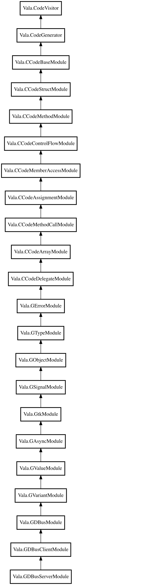

# 3.6. C Code Generation

In the previous Vala compiler steps, we verified that the validity of the Vala code. Now the compiler is ready to generate C code from the Vala source code.

In the `Vala.Compiler.run ()` (`compiler/valacompiler.vala`) method, the compiler will eventually call `Vala.CodeContext.codegen.emit ()` (`vala/valacodecontext.vala`) which starts the C code generation process.

## 3.6.1 How The Code Generation Works

### 3.6.1.1 Deciding which Vala.CodeGenerator instance type to use

Vala.CodeContext.codegen is a property for an instance of `Vala.CodeGenerator` (`vala/valacodegenerator.vala`). The object type is different based on the compiler profile that the user set:

- GObject profile: `GDBusServerModule` (`codegen/valagdbusservermodule.vala`).
- Otherwise: `CCodeDelegateModule` (`codegen/valaccodedelegatemodule.vala`)

### 3.6.1.2 Modules Pattern with C Code Generator

`Vala.CodeGenerator` is an abstract class that is a code visitor for generating code. This is the base class for code generators in the compiler, it contains abstract methods to be overriden by subclasses that help wit hthe code generation process too.

The actual code generation logic is contained in its subclasses. The direct subclass of `Vala.CodeGenerator` is `Vala.CCodeBaseModule` (`codegen/valaccodebasemodule.vala`). Which actually overrides the `Vala.CodeVisitor` methods.

`Vala.CCodeBaseModule` contains the logic that provides the base functionality for generating C code from Vala code.

Inheritance is used to stack code generation functionality between subclasses, expanding on the method overrides of parent classes. are modules that provide functionality for the code generation process.

`Vala.CCodeBaseModule` is a module that provides base functionality for the code generation process. For additional functionality, `Vala.CCodeStructModule` (`codegen/valaccodestructmodule.vala`) extends the `Vala.CCodeBaseModule` class, however the module specifically handles how C structs should be generated from Vala code. We keep stacking functionality using modules in the inheritance tree until we've reached the desired amount of functionality. That's where the instance types based on the profiles come in. They've implemented an appropriate amount of functionality to be able to generate code for those profiles.

::: info Note
All of the code generation modules (e.g. `CCodeArrayModule`, `CCodeAssignmentModule`, `GAsyncModule`, `GObjectModule`, and others) live in the `codegen` directory, following the `vala<class-name-lowercase>.vala` naming convention.
:::

However, as more features are added to the language, the inhertiance trees for the code generation classes `Vala.CodeGenerator` classes may grow further. Or a slightly different inheritance tree may be created for new profile, with modules that are specific for that new profile.

Here's the object hiearchy graph for the `Vala.GDBusServerModule` class:

<!-- Then show how inheritance tree of GDBusServerModule so the reader has a visual understanding of the Vala.CodeGenerator inheritance -->

## 3.6.2. Attributes

C code generation is the largest single consumer of attributes in the
compiler, specifically of `CCode` - see
[3.2.5. Attributes](./03-02-parser#3-2-5-attributes) for how attributes are
parsed and stored in general.

Wherever a code generation module needs to know how a Vala symbol maps onto
C - its C identifier, header filename, type id, ref and unref functions and
so on - it calls one of the `Vala.get_ccode_*()` functions in
`codegen/valaccode.vala`, such as `Vala.get_ccode_name ()`,
`Vala.get_ccode_const_name ()`, `Vala.get_ccode_type_name ()` and
`Vala.get_ccode_header_filenames ()`. There are around seventy of these
public wrapper functions in total.

Each one is backed by `Vala.CCodeAttribute` (`codegen/valaccodeattribute.vala`),
which wraps a single code node and exposes the C-level information the
generator needs as properties - `name`, `const_name`, `type_name`,
`header_filenames`, `prefix`, `ref_function` and many more. Every property
lazily reads the corresponding `CCode` argument from the node's raw
`Vala.Attribute`, and, when that argument wasn't given in the source, computes
a sensible default from the Vala symbol instead. So `[CCode (cname = "...")]`
overrides a C name that would otherwise be derived automatically from the
Vala declaration's name.

`Vala.CodeNode` supports caching this generically: a node carries an
`attributes_cache` array of `Vala.AttributeCache` slots, accessed with
`get_attribute_cache ()` and `set_attribute_cache ()`, and each kind of cache
claims a unique slot index from the static
`Vala.CodeNode.get_attribute_cache_index ()`. `Vala.CCodeAttribute` extends
`Vala.AttributeCache`, so exactly one instance is created per code node - the
first time any `get_ccode_*` function is called on it - and every later call
reuses it rather than re-reading and re-deriving attribute strings.
