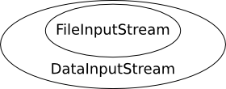

# GIO Samples

[GIO](https://docs.gtk.org/gio/) is similar to the Java I/O framework. References
to files and directories are represented by `File` objects, which you create from
a path or a URI. GIO provides two base classes for input and output:
`InputStream` and `OutputStream`. Opening a file for reading yields a
`FileInputStream`, a subclass of `InputStream`.

Streams can be wrapped ([decorator pattern](http://en.wikipedia.org/wiki/Decorator_pattern)) for extra behaviour—for example, wrap a
`FileInputStream` in a `DataInputStream` to read line by line, or use a
`FilterInputStream` for custom filtering.



Build the programs below with GIO, for example:

```shell
valac --pkg=gio-2.0 example.vala
```

## Reading Text File Line by Line

The following example reads the contents of a text file line by line and prints
each line to standard output.

```vala
int main () {
    // A reference to our file
    var file = File.new_for_path ("data.txt");

    if (!file.query_exists ()) {
        stderr.printf ("File '%s' doesn't exist.\n", file.get_path ());
        return 1;
    }

    try {
        // Open file for reading and wrap returned FileInputStream into a
        // DataInputStream, so we can read line by line
        var dis = new DataInputStream (file.read ());
        string line;
        // Read lines until end of file (null) is reached
        while ((line = dis.read_line (null)) != null) {
            stdout.printf ("%s\n", line);
        }
    } catch (Error e) {
        error ("%s", e.message);
    }

    return 0;
}
```

### Compile and Run

```shell
valac --pkg gio-2.0 gio-sample.vala
./gio-sample
```

Streams are closed automatically when they go out of scope ([RAII](http://en.wikipedia.org/wiki/Resource_Acquisition_Is_Initialization)); you do not
need to close them explicitly.

## File Objects

A `File` object represents a path to a resource (file or directory). It does not
imply that the resource exists because the `File` object itself does not do I/O operations. 
It only stores the path. You can check if the `File` exists with [`File.query_exists ()`](https://valadoc.org/gio-2.0/GLib.File.query_exists.html):

```vala
if (file.query_exists ()) {
    // File or directory exists
}
```

To test whether the resource is a directory, query its `FileType`:

```vala
if (file.query_file_type (0) == FileType.DIRECTORY) {
    // It's a directory
}
```

Create `File` instances from a path or a URI:

```vala
var data_file = File.new_for_path ("data.txt");
var message_of_the_day = File.new_for_path ("/etc/motd");
var home_dir = File.new_for_path (Environment.get_home_dir ());
var web_page = File.new_for_uri ("https://example.com/");
```

These are static factory methods, not constructors, because `File` is an
interface; they return instances of classes implementing `File`.

GIO can access local files and many remote schemes (HTTP, FTP, SFTP, SMB, DAV,
and more) through GVFS. Prefer passing `File` objects between APIs instead of raw
strings when you work with paths. it will be very easy to derive paths for parent
and child directories without having to agonize over string manipulations and path separators:

```vala
var home_dir = File.new_for_path (Environment.get_home_dir ());
var bar_file = home_dir.get_child ("foo").get_child ("bar.txt");
var foo_dir = bar_file.get_parent ();
```

Use `get_path ()` for a full path string, or `get_basename ()` for the last path
component.

## Some Simple File Operations

Creating, renaming, copying, and deleting files. These operations are synchronous.

```vala
int main () {
    try {
        // Reference a local file name
        var file = File.new_for_path ("samplefile.txt");

        {
            // Create a new file with this name
            var file_stream = file.create (FileCreateFlags.NONE);
            
            // Test for the existence of file
            if (file.query_exists ()) {
                stdout.printf ("File successfully created.\n");
            }

            // Write text data to file
            var data_stream = new DataOutputStream (file_stream);
            data_stream.put_string ("Hello, world");
        } // Streams closed at this point

        // Determine the size of file as well as other attributes
        var file_info = file.query_info ("*", FileQueryInfoFlags.NONE);
        stdout.printf ("File size: %lld bytes\n", file_info.get_size ());
        stdout.printf ("Content type: %s\n", file_info.get_content_type ());

        // Make a copy of file
        var destination = File.new_for_path ("samplefile.bak");
        file.copy (destination, FileCopyFlags.NONE);

        // Delete copy
        destination.delete ();

        // Rename file
        var renamed = file.set_display_name ("samplefile.data");

        // Move file to trash
        renamed.trash ();

        stdout.printf ("Everything cleaned up.\n");

    } catch (Error e) {
        stderr.printf ("Error: %s\n", e.message);
        return 1;
    }

    return 0;
}
```

On Windows, files cannot be renamed while they are open; the inner block
ensures streams are released before later steps.

### Compile and Run

```shell
valac --pkg gio-2.0 gio-file-operations.vala
./gio-file-operations
```

## Writing Data

This sample creates an output file and writes text. For long writes, loop until
all bytes are written.

```vala
int main () {
    try {
        // An output file in the current working directory
        var file = File.new_for_path ("out.txt");

        // Delete if file already exists
        if (file.query_exists ()) {
            file.delete ();
        }

        // Creating a file and a DataOutputStream to the file
        /*
            Use BufferedOutputStream to increase write speed:
            var dos = new DataOutputStream (new BufferedOutputStream.sized (file.create (FileCreateFlags.REPLACE_DESTINATION), 65536));
        */
        var dos = new DataOutputStream (file.create (FileCreateFlags.REPLACE_DESTINATION));

        // Writing a short string to the stream
        dos.put_string ("this is the first line\n");

        string text = "this is the second line\n";
        // For long string writes, a loop should be used, because sometimes not all data can be written in one run
        // 'written' is used to check how much of the string has already been written
        uint8[] data = text.data;
        long written = 0;
        while (written < data.length) {
            // sum of the bytes of 'text' that already have been written to the stream
            written += dos.write (data[written:data.length]);
        }
    } catch (Error e) {
        stderr.printf ("%s\n", e.message);
        return 1;
    }

    return 0;
}
```

### Compile and Run

```shell
valac --pkg gio-2.0 gio-write-data.vala
./gio-write-data
```

## Reading Binary Data

This sample reads [BMP header fields](http://en.wikipedia.org/wiki/BMP_file_format#Example_1) and image data. Point `File.new_for_path`
at a real `.bmp` file on your machine (the archived wiki used a remote URL that
may no longer work).

```vala
int main () {
    try {

        // Reference a BMP image file
        var file = File.new_for_uri ("http://wvnvaxa.wvnet.edu/vmswww/images/test8.bmp");
        // Alternative:  
        // var file = File.new_for_path ("sample.bmp");

        // Open file for reading
        var file_stream = file.read ();
        var data_stream = new DataInputStream (file_stream);
        data_stream.set_byte_order (DataStreamByteOrder.LITTLE_ENDIAN);

        // Read the signature
        uint16 signature = data_stream.read_uint16 ();
        if (signature != 0x4d42) { // this hex code means "BM"
            stderr.printf ("Error: %s is not a valid BMP file\n", file.get_basename ());
            return 1;
        }

        data_stream.skip (8); // skip uninteresting data fields
        uint32 image_data_offset = data_stream.read_uint32 ();

        data_stream.skip (4);
        uint32 width = data_stream.read_uint32 ();
        uint32 height = data_stream.read_uint32 ();

        data_stream.skip (8);
        uint32 image_data_size = data_stream.read_uint32 ();

        // Seek and read the image data chunk
        uint8[] buffer = new uint8[image_data_size];
        file_stream.seek (image_data_offset, SeekType.CUR);
        data_stream.read (buffer);

        // Show information
        stdout.printf ("Width: %ld px\n", width);
        stdout.printf ("Height: %ld px\n", height);
        stdout.printf ("Image data size: %ld bytes\n", image_data_size);

    } catch (Error e) {
        stderr.printf ("Error: %s\n", e.message);
        return 1;
    }

    return 0;
}
```

### Compile and Run

```shell
valac --pkg gio-2.0 gio-binary-sample.vala
./gio-binary-sample
```

## Enumerating Directory Content

```vala
int main (string[] args) {
    try {
        var directory = File.new_for_path (".");

        if (args.length > 1) {
            directory = File.new_for_commandline_arg (args[1]);
        }

        var enumerator = directory.enumerate_children (FileAttribute.STANDARD_NAME, 0);

        FileInfo file_info;
        while ((file_info = enumerator.next_file ()) != null) {
            stdout.printf ("%s\n", file_info.get_name ());
        }

    } catch (Error e) {
        stderr.printf ("Error: %s\n", e.message);
        return 1;
    }

    return 0;
}
```

### Compile and Run

```shell
valac --pkg gio-2.0 gio-ls.vala
./gio-ls
```

## Asynchronous File Listing

::: tip GTK+ 3

This example needs **GTK+ 3** (`gtk+-3.0`). Install your distribution’s GTK+ 3
development packages to compile and run it. For a console-only asynchronous
directory listing using the same GIO calls, see the
[GIO Example](async-samples#gio-example) on the Async Method Samples page.

Learn more about GTK at [gtk.org](https://gtk.org).
:::

This sample loads files from the user’s home directory with asynchronous GIO
calls and shows them in a GTK+ list view (adapted from the archived GNOME Wiki).

```vala
using Gtk;

/**
 * Loads the list of files in the user's home directory and displays them
 * in a GTK+ list view.
 */
class ASyncGIOSample : Window {

    private ListStore model;

    public ASyncGIOSample () {

        // Set up the window
        set_default_size (300, 200);
        this.destroy.connect (Gtk.main_quit);

        // Set up the list widget and its model
        this.model = new ListStore (1, typeof (string));
        var list = new TreeView.with_model (this.model);
        list.insert_column_with_attributes (-1, "Filename",
                                            new CellRendererText (), "text", 0);

        // Put list widget into a scrollable area and add it to the window
        var scroll = new ScrolledWindow (null, null);
        scroll.set_policy (PolicyType.NEVER, PolicyType.AUTOMATIC);
        scroll.add (list);
        add (scroll);

        // Start file listing process
        list_directory.begin ();
    }

    private async void list_directory () {
        stdout.printf ("Start scanning home directory\n");
        var dir = File.new_for_path (Environment.get_home_dir ());
        try {
            // Asynchronous call to get directory entries
            var e = yield dir.enumerate_children_async (FileAttribute.STANDARD_NAME,
                                                        0, Priority.DEFAULT, null);
            while (true) {
                // Asynchronous call to get entries so far
                var files = yield e.next_files_async (10, Priority.DEFAULT, null);
                if (files == null) {
                    break;
                }
                // Append the files found so far to the list
                foreach (var info in files) {
                    TreeIter iter;
                    this.model.append (out iter);
                    this.model.set (iter, 0, info.get_name ());
                }
            }
        } catch (Error err) {
            stderr.printf ("Error: list_files failed: %s\n", err.message);
        }
    }

    static int main (string[] args) {
        Gtk.init (ref args);

        var demo = new ASyncGIOSample ();
        demo.show_all ();

        Gtk.main ();
        return 0;
    }
}
```

### Compile and Run

```shell
valac --pkg gtk+-3.0 gio-async.vala
./gio-async
```

## Asynchronous Stream Reading

```vala
MainLoop main_loop;

async void read_something_async (File file) {
    var text = new StringBuilder ();
    print ("Start...\n");

    try {
        var dis = new DataInputStream (file.read ());
        string line = null;
        while ((line = yield dis.read_line_async (Priority.DEFAULT)) != null) {
            text.append (line);
            text.append_c ('\n');
        }
        print (text.str);
    } catch (Error e) {
        error (e.message);
    }
    main_loop.quit ();
}

void main (string[] args) {

    var file = File.new_for_uri ("https://www.gnome.org/");

    if (args.length > 1) {
        file = File.new_for_commandline_arg (args[1]);
    }

    main_loop = new MainLoop ();
    read_something_async (file);
    main_loop.run ();
}
```

### Compile and Run

```shell
valac --pkg gio-2.0 gio-async-reading.vala
./gio-async-reading
```

Network access is required when using the default URI.
